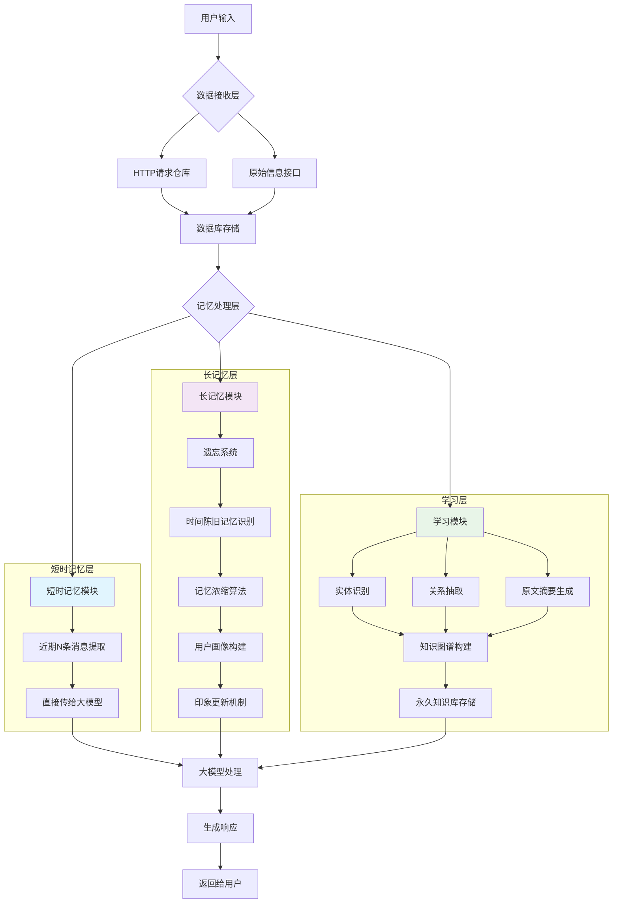

# AI长记忆系统设计

## 概述

本项目旨在解决AI长记忆的难点——记忆的浓缩问题。传统的做法是直接将原始信息传递给大模型，但这会占用大量上下文资源并容易造成提示词污染。随着时间推移，系统可能仍能检索到所有历史细节，这与人类记忆机制不符。

人类记忆具有选择性：刚开始的对话内容能够清晰记住，但随着时间推移，具体细节会逐渐模糊，只保留大致印象，只有情绪强烈的场景才会保留较多细节。

## 系统架构

本系统采用三层记忆架构，模拟人类记忆机制：

### 1. 短时记忆层
- 传统记忆模式
- 查询数据库，提取最近N条消息直接传递给大模型
- 保证近期对话的准确性和连贯性

### 2. 长记忆层
- 构建模糊的用户画像
- 设计遗忘系统，对陈旧记忆进行浓缩存储
- 类似于人对另一个人的整体印象
- 每次生成新印象时参考历史印象，调用时仅使用最新印象

### 3. 学习层
- 自主构建知识图谱
- 接收原始数据并通过HTTP接口存储在数据库中
- 从对话中提取实体、关系及原文摘要构建知识图谱
- 知识库中的知识不会遗忘，类似人类学习到的知识

## 技术实现

1. **数据接入**：设计HTTP请求仓库或原始信息接口接收数据
2. **数据存储**：使用数据库存储原始信息
3. **知识处理**：从对话中提取实体和关系，构建包含实体概念、实体关系和原文摘要的知识图谱
4. **记忆管理**：通过遗忘系统处理时间陈旧的记忆，进行记忆浓缩

## 核心优势

- 模拟人类记忆机制，实现更自然的记忆管理
- 分层设计兼顾短期对话准确性和长期记忆有效性
- 知识图谱确保重要知识不会遗忘
- 遗忘系统避免信息过载，提高系统效率

